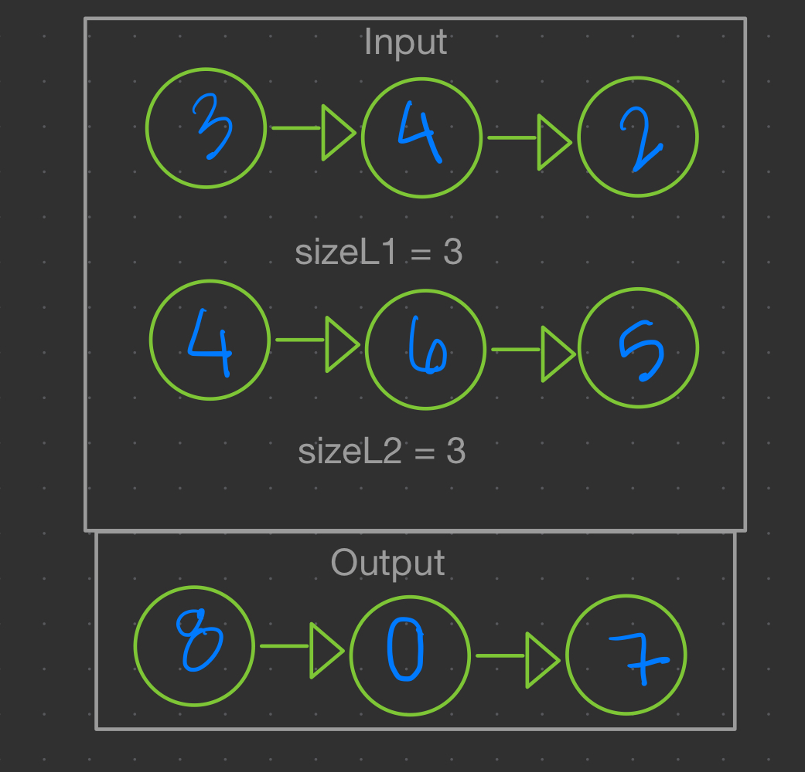
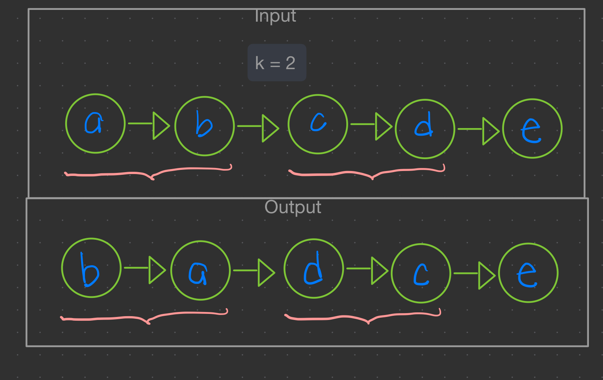
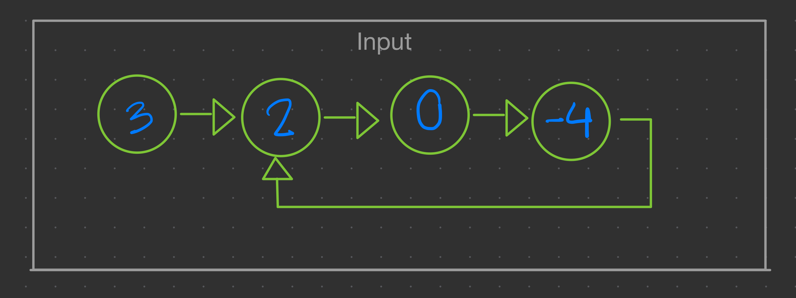
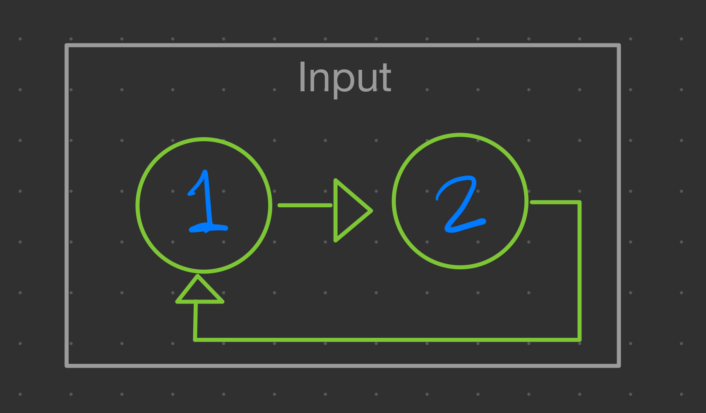
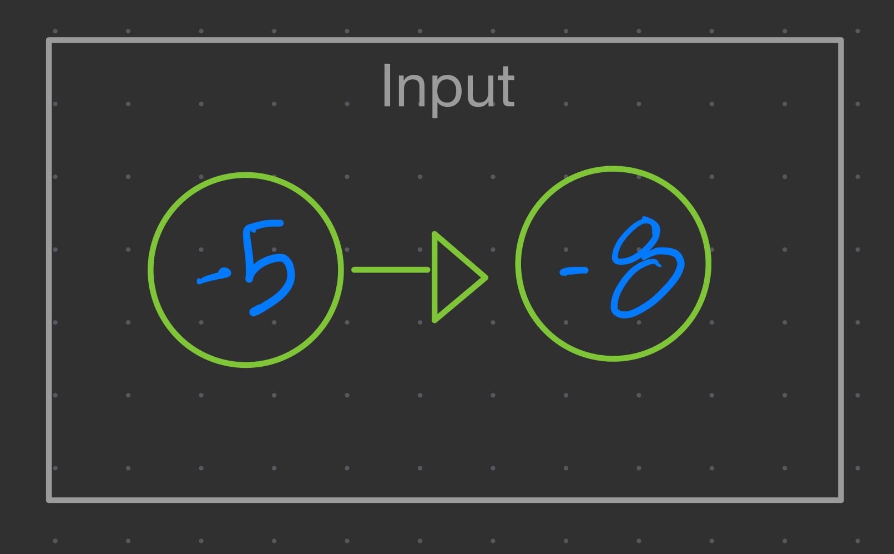

# Parcial de Reposición

- [Parcial de Reposición](#parcial-de-reposición)
  - [Instrucciones](#instrucciones)
  - [Introducción](#introducción)
  - [Ejercicio 1 (50 puntos)](#ejercicio-1-50-puntos)
    - [Ejemplo 1.1](#ejemplo-11)
  - [Ejemplo 1.2](#ejemplo-12)
  - [Ejemplo 1.3](#ejemplo-13)
    - [Restricciones](#restricciones)
  - [Ejercicio 2 (25 puntos)](#ejercicio-2-25-puntos)
    - [Ejemplo 2.1](#ejemplo-21)
    - [Ejemplo 2.2](#ejemplo-22)
    - [Restricciones](#restricciones-1)
  - [Ejercicio 3 (25 puntos)](#ejercicio-3-25-puntos)
    - [Ejemplo 3.1](#ejemplo-31)
    - [Ejemplo 3.2](#ejemplo-32)
    - [Ejemplo 3.3](#ejemplo-33)
    - [Restricciones](#restricciones-2)

## Instrucciones

1. Para iniciar, debe crear un *Fork* del repositorio:

2. Vaya la pestaña de **actions** de su repositorio. Si ve un botón verde, haga clic en él para poder ejecutar las pruebas en el futuro.

3. Clone el nuevo repositorio en su computadora y ábralo en Visual Studio.

4. En el menú de Visual Studio, en la sección de *Build* o *Compilar*, construya la solución.

5. En el menú de Visual Studio, en la sección de Tests, seleccione *Run All Tests*

6. La mayoría de las pruebas deberían fallar.

## Introducción

- Todos los ejercicios deben compilar para poder ser probados. Si por lo menos uno de los ejercicios no compila, la nota será **cero**.
- Si el código original de un ejercicio no se modifica o la intención de su resolución no es clara, la nota del ejercicicio será de **cero puntos**, aún si hay pruebas que sí pasen para dicho ejercicio.
- NO agregue nuevos métodos `main()`, de lo contrario ninguna prueba podrá ejecutarse.
- NO cambie la firma de los métodos existentes (no agrege más parámetros ni cambie el nombre), estos son utilizados para probar su código.
- NO haga cambios en las pruebas, esto resulta en un **cero inmediato**.
- Para este examen parcial está prohibido utilizar librerías de estructuras de datos lineales como `stack`, `queue`, `list`, etc. Usted debe implementar sus propias estructuras de datos.
- Puede agregar nuevas clases y/o archivos, como sea necesario.
- Las definiciones de funciones y atributos de las clases se encuentran en archivos `.h`, pero debe implementar las funciones dentro de los `.cpp` equivalentes.
- A continuación encontrará los enunciados de cada uno de los ejercicios. Su nota en cada uno de los ejercicios será la relación entre la cantidad de pruebas que sí pasen sobre la cantidad total de pruebas para ese ejercicio.
- En la pestaña de **Actions** podrá ver como las pruebas se ejecutan con su código implementado (si hace `git push` previamente). En los últimos pasos, puede ver los resultados y su nota:

___

## Ejercicio 1 (50 puntos)

Dadas dos listas no vacías, `l1` y `l2` (con sus respectivos tamaños `sizeL1` y `sizeL2`), que representan números enteros no negativos, encuentre la suma de ambos números. Los dígitos de cada número se encuentran en orden natural; cada uno de los nodos contiene un dígito unicamente.

Asuma que ninguno de los dos números se representa con ceros a la izquierda.

### Ejemplo 1.1

___

## Ejemplo 1.2

    l1 = [0], sizeL1 = 1
    l2 = [0], sizeL2 = 1
    resultado = [0]
___

## Ejemplo 1.3

    l1 = [9 -> 9 -> 9 -> 9 -> 9 -> 9 -> 9], sizeL1 = 7
    l2 = [9 -> 9 -> 9 -> 9], sizeL2 = 4
    resultado = [1 -> 0 -> 0 -> 0 -> 9 -> 9 -> 9 -> 8]
___

### Restricciones

- La cantidad de nodos para cada lista se encuentra entre **1** y **360**.
- Se garantiza que `sizeL1` tiene la cantidad exacta de nodos de la lista `l1`.
- Se garantiza que `sizeL2` tiene la cantidad exacta de nodos de la lista `l2`.
- `1` <= `sizeL1, sizeL2` <= `360`
- Ningún número se representa con ceros a la izquierda.

___

## Ejercicio 2 (25 puntos)

Dado el nodo `head` de una lista simplemente enlazada, invierta `k` nodos a la vez y retorne la lista *modificada*.

`k` es un entero positivo. Si, al final de la lista, la cantidad de nodos excluídos no es un múltiplo de `k`, entonces esos nodos deben permanecer en su orden original.

No puede alterar ni modificar los valores de los nodos de la lista, solo los nodos pueden cambiar.

### Ejemplo 2.1

___

### Ejemplo 2.2

___

### Restricciones

- La cantidad de nodos se encuentra entre `1` y `5000`.
- `1` <= `k` <= `5000`
- `'a'` <= `Node.val` <= `z`

___

## Ejercicio 3 (25 puntos)

Dado el nodo `head` de una lista simplemente enlazada, retorne el nodo donde el *ciclo comienza*. *Si no hay ciclo, retorne `nullptr`.*

Existe un ciclo en una lista enlazada si existe un nodo en la lista que puede ser alcanzado más de una vez siguiendo ininterrumpidamente el apuntador `next`.

**No modifique la lista enlazada**.

### Ejemplo 3.1

    head = [3 -> *2 -> 0 -> -4 -> *]
    resultado = [2 -> ...]

**Explicación**: Hay un ciclo en la lista enlazada, en donde el último nodo de la lista, conecta al segundo nodo.
___

### Ejemplo 3.2

    head = [*1 -> 2 -> *]
    resultado = [1 -> ...]

**Explicación**: Hay un ciclo en la lista enlazada, en donde el último nodo de la lista, conecta al primer nodo.
___

### Ejemplo 3.3

    head = [-5 -> -8]
    resultado = nullptr

**Explicación**: No hay ciclo en la lista enlazada porque el último nodo no conecta a ningún otro nodo.
___

### Restricciones

- La cantidad de nodos se encuentra entre `0` y `10`4.
- `-10`5 <= `Node.val` <= `10`5
- La lista puede o no tener un ciclo.
